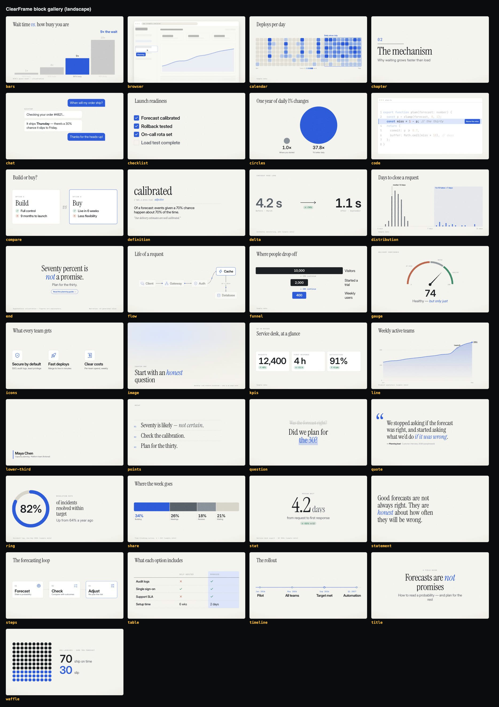
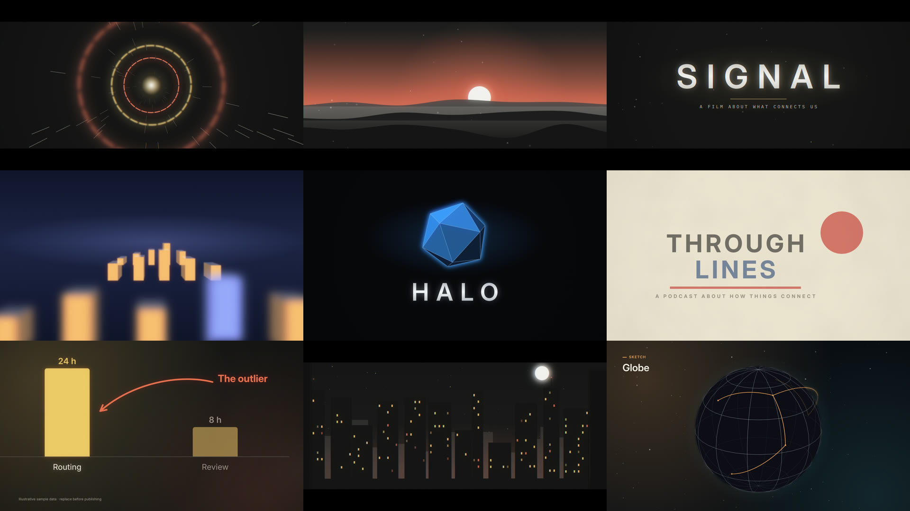

# ClearFrame

**Start here:** [`docs/guide.html`](docs/guide.html) is the guide to how ClearFrame works and how to prompt it for great films. Open it in a browser.

Agent-directed motion graphics rendered natively with **FFFrames**. A film is one `storyboard.json`, recorded speech and optional media. A Rust/SVG renderer draws the type, numbers, charts, diagrams and captions frame by frame; Google models supply speech, music, images and the occasional footage insert.



## What it makes

- **Shots, not slides.** Film grammar is built in ([docs/cinema.md](docs/cinema.md)):
  - a film `lens`: letterbox, colour grade, bloom, light leaks, handheld sway and motion blur;
  - real depth: `z` layers in perspective, a `dolly` through them, a rack `focus` on a spoken word;
  - genre playbooks: trailer, cold open, product reveal, cinematic explainer, title sequence, zoom journey;
  - set pieces to start from: horizon, skyline, ocean, tunnel, terrain, data landscape, globe, title reveal.

  `critique` scores every storyboard against the eight tells of a slideshow.

  - generated depth plates: a painted far layer, a cut-out subject and cut-out foreground from image generation, staged in depth so the camera moves through painted scenes.

  

  
- **Motion graphics, not slides.** Every scene can:
  - draw its own art (`canvas`: paths that draw on, markers travelling along routes, echo trails, morphs across cuts, spotlights, meters, hand-drawn pencil strokes);
  - sit on imagery (full or split `plate` with duotone and tint treatments);
  - flood the frame with colour (`tone`) and drift with a slow `camera`;
  - cut with `panel`, `iris` or `whip` transitions that carry one movement across the cut.

  Films take an editorial `frame`, grain and a vignette. See [canvas.md](docs/canvas.md) and [ideas.md](docs/ideas.md).
- **33 native blocks** for evidence and structure: hero type, counters, KPI cards, deltas, bars, lines, waffles, rings, donuts, funnels, area-true magnitudes, steps, timelines, flows, cycles, checklists, annotated screenshots, kinetic type (including poster `stack` type that builds as spoken). `clearframe blocks NAME` prints props and an example.
- **A creative library** ([library/](library/README.md)): palettes, treatments, sketches, playbooks and optional direction profiles, one file per item, validated on load. A project's own `library/` or a shared brand kit (`--library DIR`) adds or overrides them.
  - `treatments`: art directions such as editorial, noir, kinetic, sketchbook, blueprint, mosaic and tech.
  - `sketch`: canvas starting compositions for mechanisms (route, orbit, pipeline, network…).
  - `sculptures`: eight original 3D operations, with an optional headless Blender asset pass. Retain editable scenes and prepared clips, then compose native text and evidence. [Asset workflow](docs/sculptures.md).
  - Native `die-cut-aperture`, `moire-signal` and `folded-louvers` sketches add paper, optical and hinged forms with contrasting `paper-theatre` and `interference` treatments. [Material studies](docs/art-direction-studies.md).
  - `canvas.props.kpi`: editable dimensional headlines, comparisons, progress rails, seesaws and contribution stacks, with restrained motion. [Flat graphics, native depth and true 3D](docs/kpi-direction.md).
  - `canvas.props.teaching`: readable question, answer and explanation phases for multiple choice and fill-in-the-blank films. [Teaching sequences](docs/teaching-sequences.md).
  - `reference VIDEO`: the cut rhythm, keyframes, palette and motion of a film to borrow from.
  - `critique`: flags deck-like runs, stillness, text density, weak hooks and "and then" story chains.
  - `directions research|podcast`: optional story, picture and pace combinations. `--direction ID` seeds a project; explicit playbook/treatment/theme choices override it. Custom JSON profiles and fully authored canvas scenes keep the space open.
  - `playbooks`: starting arcs, including `journey` (one drawing, a travelling camera) and `sizzle` (a brand reel).
- **From material to film:**
  - `ingest --markdown` turns a research report (or HTML/DOCX/PDF) into an evidence brief of figures, sources, tensions and chart-ready tables.
  - `ingest --audio` turns a podcast or talk into gapless beats with measured word timings, speakers and live meters.
  - The `clearframe-direction` skill walks from brief to story to look to pictures to review.
- **Type:** Inter, Inter Display and tabular figures; Instrument Serif for the italic accent word; IBM Plex Mono for labels and code; Architects Daughter for hand lettering. All are measured with the same shaper that draws them. Palettes (`clearframe themes`) are contrast-checked on load and in every tone.
- **Voice that performs:** Gemini 3.8 TTS reads the whole narration as one continuous take with one short style, so the voice stays consistent. Energy is written into the words. Also two-voice conversations, and word timings measured for free with local Whisper (`align --whisper`). Sound design (`sfx`) lands on visual peaks.
- **Honest numbers:** every figure needs a visible source; counters land on the exact value; `check` refuses what would mislead. See [speech timing](docs/speech.md) and the integrity skill.

## Start

Requires Node 20.10+, Rust 1.88+, FFmpeg/ffprobe and native codecs. Follow [native setup](fframes/SETUP.md) before the first build. There are no npm runtime dependencies and no browser.

Blender is an **optional separate installation** for preparing new 3D sculpture assets. The bundled clips, native KPI forms and teaching templates work without it. See [dimensional art setup](fframes/SETUP.md#optional-dimensional-art-setup) for executable checks, `BLENDER_BIN`, resource limits and replay commands using the included assets. No pip packages, addons or new npm dependencies are required.

```sh
node engine/cli.mjs doctor
node engine/cli.mjs new my-film --playbook data-story --treatment editorial
node engine/cli.mjs critique my-film              # rhythm, density, hook and story links, instantly
node engine/cli.mjs draft my-film                 # draft voice + check + sheet + draft MP4 in one pass
# Replace the illustrative claims in my-film/storyboard.json, then:
node engine/cli.mjs sheet my-film --draft      # contact sheet
node engine/cli.mjs voice my-film --draft      # free local narration
node engine/cli.mjs check my-film --draft      # validation + native diagnostics
node engine/cli.mjs render my-film --draft     # fast review MP4
node engine/cli.mjs render my-film             # final encode
```

Open the contact sheet, then watch and listen to the MP4. `build/video.mp4.json` records input hashes, renderer revision, encoder, audio provenance, output hash and color space. Drafts keep authored layout and frame rate, allow provisional voice timing, and use a fast encoder. Optional `--scale 0.5` writes a smaller review copy; final output stays at authored resolution.

## From an idea, document and brand

`start` gathers the material into one portable project with an evidence brief, brand rules, copied assets and hashes. It prepares an illustrative arc for the directing agent to rewrite; no API calls are made.

```sh
node engine/cli.mjs start my-film --idea 'Explain cash timing' --document report.md --brand brand.json --playbook cash-flow
node engine/cli.mjs critique my-film
node engine/cli.mjs pipeline my-film --draft --scale 0.5
```

Research and podcasts can start from an evidence investigation, a mechanism, field notes, a visual essay, kinetic type or a drawn explanation. [Source adaptation and creative freedom](docs/source-playbooks.md) · [Custom directions](library/README.md#directions). The agent still authors the film from the actual source.

Financial arcs: `cash-flow`, `scenario-lab` and `risk-tradeoffs`, with native animated mechanisms. [Intake and brand kit](docs/intake.md) · [Financial playbooks](docs/financial-playbooks.md) · [Free example](examples/financial-intake/README.md). The focus is a mature standalone production pipeline, exercised through its CLI before any host integration. [Production method and harness](docs/production.md).

## From a document or recording

```sh
node engine/cli.mjs ingest digest --markdown report.md        # BRIEF.md: figures, sources, tensions, tables
node engine/cli.mjs ingest clip --audio episode.wav --words words.json --script script.txt --from 312 --to 358 --vertical
node engine/cli.mjs reference inspiration.mp4                 # REFERENCE.md + keyframe sheet
node engine/cli.mjs align clip --whisper                      # free, local, measured word timings
```

Then follow `skills/clearframe-direction/SKILL.md`: find the question and the turn, pick a treatment, plan a picture per beat, critique, and have a fresh reviewer read the sheet.

## Authoring and review

`storyboard.json` is the single source for scenes, data, palette, motion and cues; the [engine skill](skills/clearframe-engine/SKILL.md) describes the contract and [the style guide](docs/style.md) the design system. Canvases are landscape, vertical, square and portrait at 24/25/30/50/60 fps.

Cue anything to speech: `land`, `growSay`, `drawSay` and per-item `say` take an exact spoken word or phrase. `check` refuses what would mislead or break a film instead of rendering it quietly wrong:

- numbers without a visible source and a `sources` entry, negative bars or scales that do not cover the data;
- beats that end before their counters and bars reach the true values;
- items cued too late to finish entering, text that overflows its box at 14 px;
- speech-following text on estimated timing, or characters the bundled fonts cannot draw.

`looks DIR --beat ID` renders one frame in every palette. `still --beat ID` inspects a moment; `review DIR` decodes the encoded MP4 around every cut and word boundary. `qa DIR` reads the whole film for time bugs: one-frame pops, stretches where the picture barely changes (measured as change per second against the frame a second earlier), world seams that jump, export tags and loudness; it writes a one-frame-per-second timeline and a 360 px phone sheet. `beatmap DIR` measures the music's tempo and drop, and `music.drop` lands that drop on a beat. Paid commands are explicit: `plan` estimates spend, then `voice`, `music`, `images`, `clips` or `align --transcribe` call Google. Existing recordings and imported timestamps need no API key.

## Development

```sh
/Users/brandon/.local/bin/codex-heavy -- npm test                     # full suite on this shared 8 GB Mac
node engine/cli.mjs build                                            # native renderer (warm cache)
node engine/cli.mjs gallery build/gallery-paper --theme paper
node engine/cli.mjs gallery build/gallery-ink --vertical --theme ink
/Users/brandon/.local/bin/codex-heavy -- node scripts/verify-native.mjs build/native-verification-new
```

`engine/` owns orchestration, timing, generation and audio. `fframes/catalog.mjs` owns block metadata, `validators.mjs` prop validation, `registry.mjs` per-block runtime rules, `constants.json` shared timing, `playbooks.mjs`/`treatments.mjs`/`sketches.mjs` starting points, `job.mjs` storyboard → job, `prepare.mjs`/`render.mjs` media and outputs (re-exported by `production.mjs`). The Rust renderer in `fframes/native/src/` is split into `text` (shaping and fitting), `design` (palettes, tones, backdrops, texture), `motion` (curves, exits), `constants` (shared timing), `scenes` (layout grid and helpers), `story`, `speech`, `compositor` (camera, plates, transitions), `canvas` (author-drawn elements), `charts`, `diagrams` and `media`. `npm run catalog:sync` regenerates the schema, block reference and recipes. Native compilation and the production pipeline take the machine-wide `codex-heavy` lock (one Cargo job); retain 20 GiB free for warm builds and allow 30 GiB for cold builds. `doctor` warns below 20 GiB. On other machines without the local gate, run `npm test` directly and serialize expensive work.

Fonts are static instances derived from the pinned OFL Inter source (`fframes/native/tools/generate-fonts.py`); icons are 95 MIT Tabler outlines at a pinned revision (`fetch-icons.py`, `generate-icons.py`). The retired HTML/GSAP engine is preserved in [archive/](archive/README.md) for recovery only.

[Changelog](CHANGELOG.md) · [Verification evidence](docs/verification.md) · [GitHub research and reuse policy](docs/research/2026-github-video-patterns.md) · [Migration notes](docs/fframes-migration.md)
