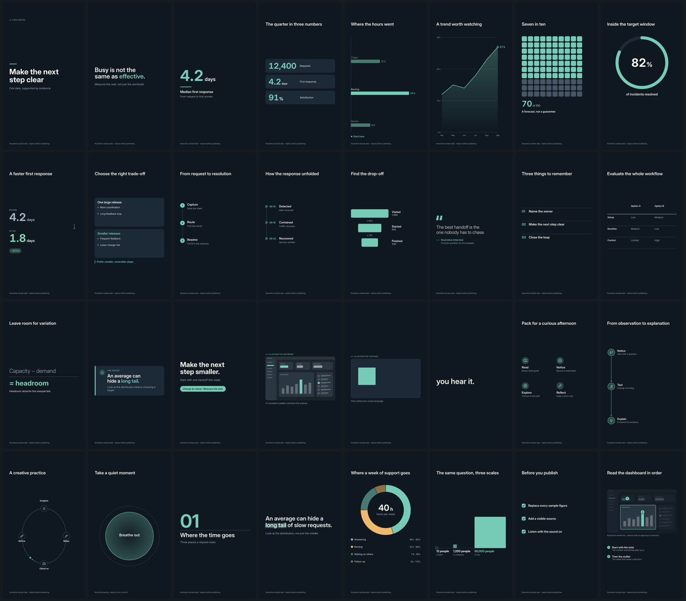
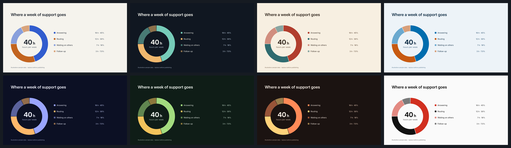
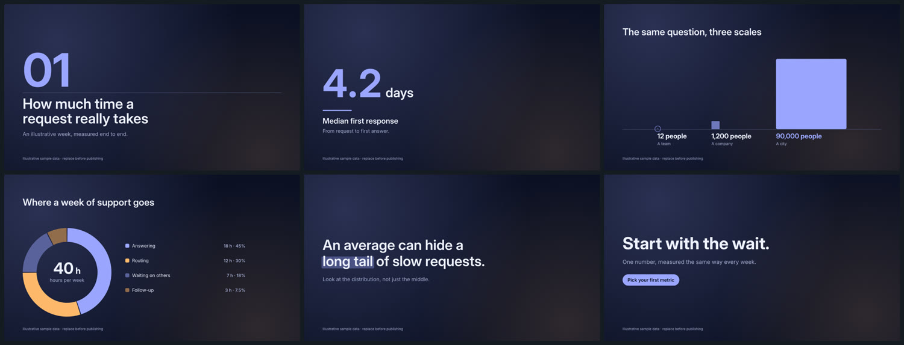

# ClearFrame

Agent-directed motion graphics rendered natively with **FFFrames**. A film is one `storyboard.json`, recorded speech and optional media. A Rust/SVG renderer draws the type, numbers, charts, diagrams and captions frame by frame; Google models supply speech, music, images and the occasional footage insert.


## What it makes

- **32 native blocks** — hero typography, chapter openers and marker highlights; counters, KPI cards and before/after deltas; bars, lines, waffles and pictograms, rings, donuts, funnels and area-true magnitude comparisons; steps, timelines, flows, cycles, checklists and icon grids; image and video plates, annotated screenshots, and speech-following kinetic text. `clearframe blocks` lists them by purpose; `blocks NAME` prints props and a ready example. [Reference](skills/clearframe-library/references/blocks.md).
- **24 playbooks** — reports, explainers, data stories, decision memos, incident reviews, product and screen walkthroughs, lessons, recipes, travel, language practice, checklists, year-in-review, personal stories and quiet moments. They are starting arcs, not a menu: combine and reorder blocks freely.
- **A real type system** — Inter and Inter Display at their optical sizes, tabular figures for every counter, balanced headline wrapping, line-by-line masked reveals and whole-word accent emphasis, all measured with the same shaper that draws the pixels.
- **Eight palettes** — `paper`, `ink`, `editorial`, `signal`, `midnight`, `forest`, `ember`, `mono`, each contrast-checked, with a secondary accent and a slow-drifting `glow` backdrop. Override any token in hex.
- **Choreographed motion** — `gentle`, `snappy` or `spring` curves at any intensity; entrances (`cut`, `fade`, `rise`, `wipe`, `push`, `zoom`) and exits that mirror the next scene; values that count in step with the marks they describe and always land on the exact authored number.
- **Speech-led text** — phrase highlighting, word reveals and one-word mode, burned captions and SRT/VTT, all tied to measured word timestamps of the exact recording. [Speech workflow](docs/speech.md).
- **Occasional generated inserts** — Gemini Omni footage and Gemini images that follow the film's palette and continuity brief, capped at a share of runtime. [Continuity](docs/continuity.md).

| | |
|---|---|
|  |   |

## Start

Requires Node 20.10+, Rust 1.88+, FFmpeg/ffprobe and native codecs. Follow [native setup](fframes/SETUP.md) before the first build. There are no npm runtime dependencies and no browser.

```sh
node engine/cli.mjs doctor
node engine/cli.mjs new my-film --playbook data-story --theme midnight
# Replace the illustrative claims in my-film/storyboard.json, then:
node engine/cli.mjs sheet my-film --draft      # contact sheet
node engine/cli.mjs voice my-film --draft      # free local narration
node engine/cli.mjs check my-film --draft      # validation + native diagnostics
node engine/cli.mjs render my-film --draft     # fast review MP4
node engine/cli.mjs render my-film             # final encode
```

Open the contact sheet, then watch and listen to the MP4. `build/video.mp4.json` records input hashes, renderer revision, encoder, audio provenance, output hash and color space. Drafts keep the authored canvas and frame rate, allow provisional voice timing, and use a fast encoder (about 3× faster than the final encode).

## Authoring and review

`storyboard.json` is the single source for scenes, data, palette, motion and cues; the [engine skill](skills/clearframe-engine/SKILL.md) describes the contract and [the style guide](docs/style.md) the design system. Canvases are landscape, vertical, square and portrait at 24/25/30/50/60 fps.

Cue anything to speech: `land`, `growSay`, `drawSay` and per-item `say` take an exact spoken word or phrase. `check` refuses what would mislead or break a film instead of rendering it quietly wrong:

- numbers without a visible source and a `sources` entry, negative bars or scales that do not cover the data;
- beats that end before their counters and bars reach the true values;
- items cued too late to finish entering, text that overflows its box at 14 px;
- speech-following text on estimated timing, or characters the bundled fonts cannot draw.

`looks DIR --beat ID` renders one frame in all eight palettes. `still --beat ID` inspects a moment; `review DIR` decodes the encoded MP4 around every cut and word boundary. Paid commands are explicit: `plan` estimates spend, then `voice`, `music`, `images`, `clips` or `align --transcribe` call Google. Existing recordings and imported timestamps need no API key.

## Development

```sh
/Users/brandon/.local/bin/codex-heavy -- npm test                   # Node contract tests
node engine/cli.mjs build                                            # native renderer (warm cache)
node engine/cli.mjs gallery build/gallery-paper --theme paper
node engine/cli.mjs gallery build/gallery-ink --vertical --theme ink
/Users/brandon/.local/bin/codex-heavy -- node scripts/verify-native.mjs build/native-verification-new
```

`engine/` owns orchestration, timing, generation and audio. `fframes/catalog.mjs` owns block metadata and validation, `fframes/playbooks.mjs` narrative starters, `fframes/production.mjs` job preparation and rendering. The Rust renderer in `fframes/native/src/` is split into `text` (shaping and fitting), `design` (palettes, backdrops), `motion` (curves, exits), `scenes` (layout grid and story blocks), `charts`, `diagrams` and `media`. `npm run catalog:sync` regenerates the schema, block reference and recipes. The CLI gates expensive work through `codex-heavy` with one Cargo job and bounded workers; keep 20 GiB free with a warm cache, 30 GiB before a cold build.

Fonts are static instances derived from the pinned OFL Inter source (`fframes/native/tools/generate-fonts.py`); icons are 95 MIT Tabler outlines at a pinned revision (`fetch-icons.py`, `generate-icons.py`). The retired HTML/GSAP engine is preserved in [archive/](archive/README.md) for recovery only.

[Changelog](CHANGELOG.md) · [Verification evidence](docs/verification.md) · [GitHub research and reuse policy](docs/research/2026-github-video-patterns.md) · [Migration notes](docs/fframes-migration.md)
