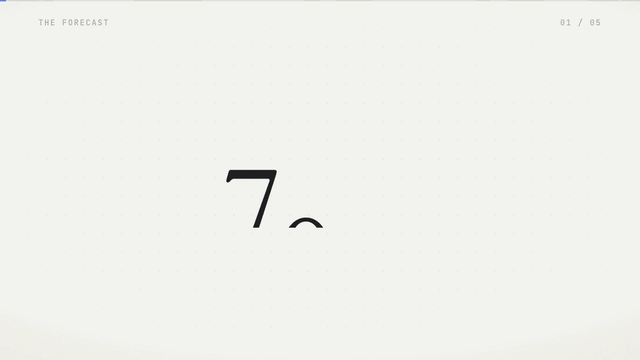
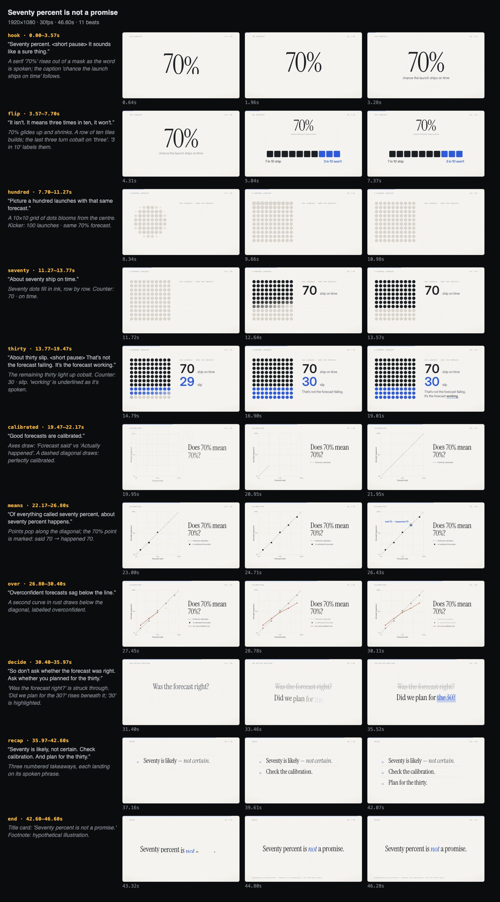

# ClearFrame

**Calm, precise motion graphics, written as code by an agent.**

ClearFrame is a light framework and a set of agent skills for making professional explainer and update videos the way the viral 2026 Opus 5.5 videos were made. Typography, numbers, charts and motion are HTML + GSAP, rendered frame by frame to MP4. Google's models fill only the gaps code can't: **Gemini TTS** for the voice, **Lyria** for the score, and occasionally **Gemini image** or **Veo** for texture or a few seconds of footage.

<p align="center"></p>

*From [`examples/seventy-percent`](examples/seventy-percent): 47 s, 11 beats, ~300 lines of scene code, $0.00 of generation (draft voice). With real Gemini narration and a Lyria bed, the whole film costs about $0.09.*

---

## Why

Most "AI video" is generative video: pretty, vague, and unable to put a correct number on screen. The videos that went viral in September 2026 took the opposite approach. A model *wrote* the film as a program, so every frame was exact, editable and cheap. ClearFrame packages that approach for the **professional register**: corporate explainers, internal updates, client education and research summaries. There, trust matters more than spectacle.

It encodes a point of view:

- **Code is the medium.** Generation fills gaps and never carries information.
- **The voice is the clock.** The script comes first, the timeline is derived from the narration, and visuals land on the spoken word.
- **One idea per beat, one focal point per frame, one accent with one meaning.**
- **Trust is the product.** Every figure is sourced or labelled hypothetical, and every disclosure is readable.
- **You must see it.** The agent renders a contact sheet, reads it, critiques it and fixes it.

The research behind these defaults, including what made the p(doom) and other viral videos land and what critics called slop, is in [`docs/research/2026-code-rendered-video.md`](docs/research/2026-code-rendered-video.md).

## Quickstart

```bash
git clone https://github.com/brandonbryant12/clearframe && cd clearframe
npm install                      # Node ≥ 20 · needs ffmpeg on PATH · downloads a headless Chrome
npm link                         # optional: `clearframe` on your PATH (else: node engine/cli.mjs …)
clearframe doctor                # checks every dependency and tells you how to fix what's missing

# zero code: a whole film from a recipe (storyboard.json only)
clearframe new my-update --recipe quarterly-update
clearframe voice my-update --draft && clearframe render my-update --draft

# or the hand-built flagship example
clearframe voice examples/seventy-percent --draft   # free, offline narration for real timing
clearframe music examples/seventy-percent --draft   # free synthesized placeholder bed
clearframe preview examples/seventy-percent         # scrub it in the browser, with sound
clearframe sheet examples/seventy-percent           # contact sheet → build/sheet.png
clearframe render examples/seventy-percent          # → build/seventy-percent-is-not-a-promise.mp4
```

Final quality, with Google's models:

```bash
export GEMINI_API_KEY=…
clearframe plan examples/seventy-percent    # what it would cost; nothing is paid for twice
clearframe voice examples/seventy-percent   # gemini-3.8-flash-tts, cached per line
clearframe music examples/seventy-percent   # lyria-3.5 bed shaped to the chapters
clearframe render examples/seventy-percent
```

## Use it with an agent

The repo *is* the harness. Open it in Claude Code (or Codex, Gemini CLI or Cursor; see [`AGENTS.md`](AGENTS.md)) and ask for a video:

> Make a 60-second explainer for our ops team on why running at 90% utilisation makes everything slower. Use the queueing numbers in the template. Paper theme, calm voice.

The agent loads the **`clearframe`** director skill and runs the workflow: brief → script → storyboard → draft sound → build scenes (in parallel subagents if it can) → **contact-sheet review loop** → spend → render → deliver with sources.

As a Claude Code plugin:
```
/plugin marketplace add brandonbryant12/clearframe
/plugin install clearframe@clearframe
```

## The library: 33 blocks, 7 recipes, no code required

Name a block on a beat and give it props; the narration drives the timing, and every reveal lands on its spoken word. A project can be just `storyboard.json`.

```jsonc
{ "id": "drivers", "block": "bars",
  "vo": "Most of the gain came from routing; macros and staffing helped less.",
  "props": { "title": "Hours saved per week", "data": [{ "label": "Routing", "value": 62 }, { "label": "Macros", "value": 21 }, { "label": "Staffing", "value": 14 }],
             "format": { "suffix": " h" }, "focus": { "label": "Routing", "say": "routing", "note": "⅔ of the gain" } } }
```

<p align="center"></p>

| Kind | Blocks |
|---|---|
| **Numbers** | `stat` (serif / counter / odometer) · `kpis` · `delta` · `ring` · `gauge` · `circles` |
| **Charts** | `bars` · `line` · `waffle` · `share` · `funnel` · `distribution` · `calendar` |
| **Structure** | `steps` · `timeline` · `flow` (system diagram with moving packets) · `compare` · `table` · `checklist` · `points` · `icons` |
| **Words** | `title` · `chapter` · `statement` (karaoke) · `quote` · `definition` · `question` · `end` |
| **Media and UI** | `browser` (spotlight, cursor, zoom) · `code` · `chat` · `image` (Ken Burns) · `lower-third` |

Every block also works in 9:16 ([vertical gallery](docs/media/blocks-vertical.jpg)). Discover them with `clearframe blocks`, `clearframe blocks <name>` (props plus an example beat) and `clearframe icons <query>` (2,000+ Lucide icons). The full reference is [`skills/clearframe-library`](skills/clearframe-library/SKILL.md). **Recipes** are complete block-only storyboards: quarterly update, concept explainer, product walkthrough, decision memo, incident review, research summary, vertical short ([list](recipes/README.md)).

Look and sound are storyboard settings:
- `theme`: `paper`, `ink`, `ember`, `editorial`, `slate` or `signal`
- `backdrop`: `dots`, `grid`, `ruled`, `topo` or `aurora`
- `chrome`, `captions` and `transition`
- `sfx`: a quiet cue set synthesized by ffmpeg (ticks, pops, whoosh, chime)

## The skills

| Skill | What it gives the agent |
|---|---|
| [`clearframe`](skills/clearframe/SKILL.md) | The director's workflow, generative budget, critique checklist, definition of done |
| [`clearframe-script`](skills/clearframe-script/SKILL.md) | Structures, hooks, writing for the ear, 140–160 wpm pacing math, vocal points, voice casting |
| [`clearframe-motion`](skills/clearframe-motion/SKILL.md) | The visual doctrine: pacing, composition, type, colour, motion tokens, sync, transitions, blueprints, **anti-slop list** |
| [`clearframe-dataviz`](skills/clearframe-dataviz/SKILL.md) | Choosing the chart, building it in the order it's spoken, honesty rules, binding figures to data |
| [`clearframe-library`](skills/clearframe-library/SKILL.md) | The block menu by intent, sequences that work, rhythm rules, look and sound settings, icons, customising and extending |
| [`clearframe-engine`](skills/clearframe-engine/SKILL.md) | Storyboard schema, blocks and scene modules, runtime API, determinism rules, kit, CLI |
| [`clearframe-integrity`](skills/clearframe-integrity/SKILL.md) | Sourcing, balanced claims, readable disclosures, captions, AI transparency, pre-delivery review |
| [`gemini-tts`](skills/gemini-tts/SKILL.md) | `gemini-3.8-flash-tts` via the Interactions API; style strings, pause tags, casting |
| [`lyria-music`](skills/lyria-music/SKILL.md) | `lyria-3.5` beds with timestamped structure from the edit; Lyria RealTime; mixing |
| [`gemini-image`](skills/gemini-image/SKILL.md) | Nano Banana 2 (`gemini-3.1-flash-image`) for textures and illustrations; never text or data |
| [`veo-video`](skills/veo-video/SKILL.md) | Veo 3.1 Lite plates, image-to-video, ≤ 20% of runtime |

Every Gemini script is zero-dependency and has a `--dry-run` that prints the exact documented request without a key. The request shapes are pinned by tests and documented in [`docs/gemini-api-contracts.md`](docs/gemini-api-contracts.md) (verified 2026-09-27).

## How it works

```
storyboard.json ──► voice (TTS or draft) ──► word alignment ──► timing.json
      │                                                            │
      ▼                                                            ▼
blocks (JSON props) + scenes/*.js (+ optional index.html) ──► CF runtime: one paused GSAP timeline, b.say('word')
      │
      ├─► preview   browser player with synced voice + music, beat scrubber, safe areas
      ├─► sheet     contact sheet PNG  ─┐
      ├─► check     automated QA       ─┴─► the agent reads, critiques, fixes
      └─► render    N headless Chrome workers seek every frame ─► ffmpeg (H.264, BT.709)
                    + mix: voice, ducked Lyria bed, sfx ─► loudnorm −14 LUFS ─► MP4
```

- **Deterministic.** Every frame is a pure function of `t`: one master timeline, seeded randomness, and a warm-up pass so tweens record their start values in canonical order. Fonts, GSAP and the runtime are served locally, so renders never touch a CDN.
- **Voice-first timing.** Each beat lasts `lead + narration + tail`. Words are aligned to the real audio by matching punctuation phrases to detected speech segments, so `b.say('seventy')` returns when the narrator actually says it.
- **Parallel-friendly.** Each scene is its own module, so several subagents can build one film at once without conflicts. A shared `STYLE.md` keeps them consistent, the same pattern Opus used in the p(doom) video.
- **Agent-legible QA.** `clearframe check` flags text cut off by the frame edge or outside the safe area, overflow, text too small for a phone, overlapping text, walls of text, narration faster than 180 wpm, stretches where nothing moves (a DOM fingerprint that ignores grain), stray tweens, missing files and figures without sources.

<p align="center"><br><sub>What the agent reads during review: <code>clearframe sheet</code>, one row per beat.</sub></p>

## Kit

The building blocks under the blocks, for custom scenes:
- **Text and numbers:** `reveal`, `counter`, `odometer`, `mark` (highlight, underline, strike)
- **Charts:** `lineChart` (monotone, value on the tip, dashed baselines), `bars`, `waffle`, `donut`, `meter`
- **Structure:** `milestones`, `steps`, `captions` (word-synced)
- **Icons:** `icon` and `drawIcon` (Lucide)
- **Camera and pointing:** `camera` (zoom-to and reset), `spotlight`, `cursor`, `transition`, `drift`
- **Texture and chrome:** `backdrop` (including `topo` contour lines), `chrome`, `chip`
- **Sourcing:** `source`, `footnote`

See [`skills/clearframe-engine/references/kit.md`](skills/clearframe-engine/references/kit.md).

## Examples and templates

| | Format | What it shows |
|---|---|---|
| [`examples/seventy-percent`](examples/seventy-percent) | 16:9 · 47 s | Probability literacy: hero number → tiles → 10×10 unit chart → calibration chart → better question → recap. Includes the `STYLE.md` pattern. |
| [`examples/one-percent`](examples/one-percent) | 9:16 · 17 s | Compounding: captions, a day counter, and two charts on separate honest scales (37.8× vs 0.03×). |
| [`templates/explainer`](templates/explainer) | 16:9 | Queueing math: number reveal, bars that grow then focus, `data.json` binding, end card with source line |
| [`templates/vertical`](templates/vertical) | 9:16 | A how-to short with burned-in captions and a FLIP-style move |

`clearframe new my-video --template explainer` scaffolds from a template.

## Costs (Gemini API list prices, 2026-09-27)

| | Model | Price | A 60 s film |
|---|---|---|---|
| Voice | `gemini-3.8-flash-tts` | $9 per 1M audio tokens (25 tokens/s) | ~$0.014 |
| Music | `lyria-3.5` | $0.08 per song | $0.08 |
| Image | `gemini-3.1-flash-image` 2K | $0.101 each | $0–0.30 |
| Footage | `veo-3.1-lite-generate-preview` 720p | $0.05/s | $0–0.40 |

Generation is cached by content hash, and `storyboard.budget` is a hard cap.

## Dependencies

Run `clearframe doctor` to verify everything below and get fix commands.

| Dependency | Needed for | Install |
|---|---|---|
| **Node.js ≥ 20** (22+ for Lyria RealTime's WebSocket) | everything | [nodejs.org](https://nodejs.org) |
| **ffmpeg** with `libx264` and `aac`, plus the `loudnorm`, `sidechaincompress`, `silencedetect`, `silenceremove`, `adelay`, `amix`, `aevalsrc` and `scale` filters | encoding, the audio mix and ducking, voice trimming and alignment, synthesized draft music and sound cues | `brew install ffmpeg` · `apt install ffmpeg` · `winget install ffmpeg` (or `npm i ffmpeg-static`, or set `FFMPEG_PATH`) |
| **Headless Chrome** (Chrome for Testing, ~200 MB) | frame capture | downloaded by `npm install` (Puppeteer); or `npx puppeteer browsers install chrome` |
| npm: `puppeteer` | driving Chrome | `npm install` |
| npm: `gsap` (Standard "no charge" license) | animation, including SplitText, CustomEase and MotionPath | `npm install` |
| npm: `lucide-static` (ISC) | 2,000+ icons | `npm install` |
| npm: `@fontsource-variable/inter`, `@fontsource/instrument-serif`, `@fontsource-variable/jetbrains-mono`, `@fontsource-variable/fraunces` (SIL OFL) | self-hosted fonts, so renders never hit a CDN | `npm install` |
| *optional* macOS `say` or `espeak-ng` | free draft narration (`voice --draft`) | built into macOS · `apt install espeak-ng` |
| *optional* `GEMINI_API_KEY` | final voice, music, images and footage (paid, cached, budget-capped) | [aistudio.google.com/apikey](https://aistudio.google.com/apikey) |

The Gemini scripts use only Node built-ins (`fetch` and `WebSocket`), with no Google SDK.

## Tests

```bash
npm test   # timing/alignment units, Gemini request contracts, block catalog + recipes, end-to-end render + QA
```

## License

MIT for ClearFrame's own code and docs. Fonts are SIL OFL (Inter, Instrument Serif, JetBrains Mono, Fraunces). GSAP uses its [Standard "no charge" license](https://gsap.com/standard-license). Generated media carries Google's SynthID watermark. See [`skills/clearframe-integrity`](skills/clearframe-integrity/SKILL.md) for disclosure guidance.

Inspired by the craft of the September 2026 code-rendered videos: John Heibel's p(doom) video and its `ANIMATION_GUIDE.md`, mexicat's kinetic-type treatment, and the many others catalogued in the research notes.
